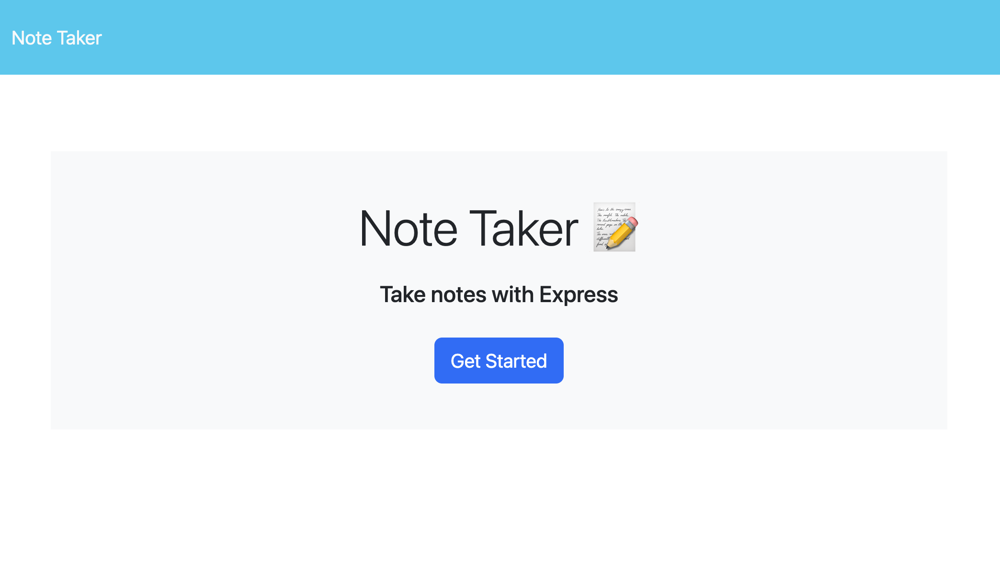

/_ robo_note_taker_express _/

# Module Challange 11: Express.js Note Taker

## Table of Contents

- [Description](#Description)
- [Preview](#Preview)
- [Usage](#Usage)
- [Installation Instructions](#Installation)
- [License](#License)
- [Questions](#Questions)

## Description

This app allows the user to input whatever notes they want to keep for themselves and allows the m to delete old notes as well. Follow this link to deploy app: https://robo-note-taker-express.herokuapp.com/

## Preview

 
<imge src="./images/note-taker-notes-demo.png">

## Usage

Users first see the index or start page and after clicking the button, proceed to be able to input a note title and note content before clicking the save button at the top of the screen. If they would like to get rid of a note they can click the trash button next to each saved note title on the left side of the screen.

## Installation

You will need node.js and npm packages for express and uuid version 4. To start the application from an IDE or command line, input node server or node server.js to run on a localhost.

## License

For information on MIT, follow this link: [MIT](https://opensource.org/licenses/MIT)

## Questions

Contact me at easorj@gmail.com

You can also view my profile: [robobrownie13](https://github.com/robobrownie13)
